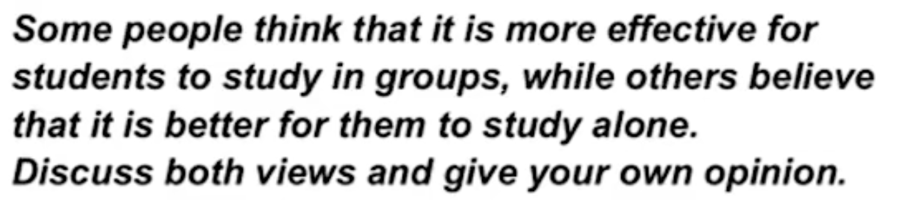

# Construction

1. Introduction(2 sentences)
2. main part(include 2/3 part)
3. End(1 sentences)
# Category

## Discussion

### Introduction

Plan:
Topic - study in groups or alone
Answer - sometimes better alone, usually better in a group

## Opinion

### Introduction
Plan:
 Topic: community service for all teenagers
Answer: 3 choices (agree, disagree, balanced opinion)

## Problem and solution

### Introduction
Plan:
Topic: criminals reoffend
Answer: several reasons, avariety of measures

## Two-part question

### Introduction

Plan:
Topic: job satisfaction
Answer: several factors, unrealistic/impossible

 